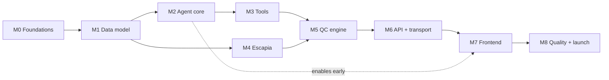

# TASKS — Road to v1

> Remaining work to reach **v1** of the Agentic Short-Term Rental Quality-Control Platform.
> Source of truth for scope is [AGENTS.md](AGENTS.md) (the PRD). This file tracks _status_ and _delivery order_; it does not restate requirements.
> Frontend design contract lives in [DESIGN.md](DESIGN.md).

**Core stack (confirmed):** Strands BIDI agent on **Gemini Live** (`gemini-3.1-flash-live-preview`) · SQLite Phase-1 schema · Python domain services · Next.js (App Router) mobile-first PWA · shadcn/ui + **AI Elements** for the BIDI surface.

---

## Legend

| Symbol | Meaning |
| --- | --- |
| ✅ | Done / present in repo |
| 🟡 | Partial — exists but incomplete for v1 |
| ⬜ | Not started |
| 🔒 | Security / compliance gate (must pass before ship) |

**Effort:** S (≤1 day) · M (2–4 days) · L (1–2 weeks) · XL (multi-week).
**Depends on** references milestone IDs (e.g., `M1`).

---

## Status snapshot (what already exists)

| Area | Status | Evidence |
| --- | --- | --- |
| Gemini Live BIDI model provider | ✅ | [gemini_live.py](harness-sdk/strands-py/src/strands/experimental/bidi/models/gemini_live.py) — audio I/O, transcription, **image input**, tool calls/results, usage, session resumption, interruption, `go_away` handling; default `gemini-3.1-flash-live-preview` |
| BIDI agent runtime + IO | ✅ | [agent.py](harness-sdk/strands-py/src/strands/experimental/bidi/agent/agent.py), `BidiAudioIO` / `BidiTextIO`; concurrent tool executor, hooks, session manager |
| Phase-1 relational schema | ✅ | [schema.sql](harness-sdk/schema.sql) — properties, spaces-as-features, stakeholders/roles, tasks + stages, checklist templates, inspections, photos, work orders, reports, maintenance |
| CSV migration (Master + roster) | ✅ | `scripts/migrate_phase1.py` (in git history; regenerate to working tree) — stage/feature parsing, issue log, secret redaction |
| Google OAuth helper | 🟡 | [gmail_auth.py](gmail_auth.py) — headless OAuth for `strands-google`; auth only, no tool wiring yet |
| Escapia API contracts | ✅ (reference) | [Escapia/](Escapia/) — OpenAPI3 + Swagger2 + consolidated HTML |
| STR application agent + tools | ⬜ | none present |
| Report generation & delivery | ⬜ | none present |
| Escapia integration client | ⬜ | none present |
| Backend API / realtime transport | ⬜ | none present |
| Frontend (Next.js PWA) | ⬜ | none present |

> **Data-model gaps confirmed:** the live schema has **no** Addendum-1 fields (`Report.delivery_channel/delivered_at/delivery_status`, `Photo.include_in_report`) and **no** Addendum-2 fields (Escapia native IDs, `SyncCursor`, `HousekeepingStatusMap`). Tracked below in `M1`.

---

## 🔒 M0 — Foundations & repo hygiene

Establish the monorepo shape so agent, services, and app can grow without churn.

- [ ] **M0.1** Define workspace layout — `apps/agent` (Python), `apps/api` (Python service), `apps/web` (Next.js), `packages/db` (schema + migrations), `packages/shared` (types/contracts). **[M]**
- [ ] **M0.2** Pin the Strands SDK: consume `harness-sdk/strands-py` via editable/vendored dependency; stop relying on the loose `strands-py/` copy. Document the pin. **[S]**
- [ ] 🔒 **M0.3** Secrets hygiene: confirm `.env`, `coral-pipe-*.json`, `gmail_credentials.json`, `gmail_token.json` are git-ignored; add `.env.example`; move real secrets to a secret manager for deploy; **rotate any key that was ever committed**. **[S]**
- [ ] **M0.4** `README` quickstart for each app + a single `make dev` / task runner. **[S]**
- [ ] **M0.5** Baseline CI (lint, type-check, unit tests) for Python and web. **[M]**

**Done when:** a fresh clone can install, type-check, and run each app's dev entrypoint from documented commands.

---

## 🔒 M1 — Data-model completion & safe persistence

- [ ] **M1.1** Regenerate `sql/phase1_schema.sql` + `scripts/migrate_phase1.py` into the working tree (recover from git history) and adopt a migration tool (Alembic or plain versioned SQL). **[M]**
- [ ] **M1.2** **Addendum-1 fields:** add `Report.delivery_channel` (enum SLACK|EMAIL|TEAMS, v1=SLACK), `Report.delivered_at`, `Report.delivery_status` (PENDING|SENT|FAILED), `Photo.include_in_report` (bool). **[S]**
- [ ] **M1.3** **Addendum-2 fields:** add `Property.escapia_unit_native_pms_id` + `escapia_pmc_id`; `Task.escapia_reservation_native_pms_id` + `escapia_housekeeping_task_native_pms_id`; `WorkOrder.escapia_work_order_native_pms_id`; `Stakeholder.escapia_owner_native_pms_id`. **[S]**
- [ ] **M1.4** New entity **`SyncCursor`** (per PMC, per resource) — `start_version` for Reservations delta; `last_polled_at` for poll-based resources. **[S]**
- [ ] **M1.5** New entity **`HousekeepingStatusMap`** — per-PMC map between platform pipeline stages and Escapia `cleanStatusID` / `unitHousekeepingStatusType`. **[S]**
- [ ] 🔒 **M1.6** Encrypt secrets at rest: door codes + Wi-Fi passwords via envelope encryption (KMS/app key); enforce the existing `*_ciphertext` / `*_secret_ref` columns end-to-end; never log plaintext. **[M]** _(NFR: Security)_
- [ ] **M1.7** Data-access layer (repository pattern) + typed models shared with the API. **[M]**
- [ ] **M1.8** Seed/fixtures for local dev (a small Big Bear cluster) + a golden test DB. **[S]**

**Done when:** migrations apply cleanly, Addendum-1/2 fields exist, secrets are never stored or logged in plaintext, and repositories have unit coverage.

---

## M2 — Agent core (the "brain")

Assemble the STR QC agent on the existing Gemini Live provider.

- [ ] **M2.1** Agent bootstrap: instantiate `BidiAgent(model=BidiGeminiLiveModel(...))` with tool registry, hooks, and a `SessionManager` for cross-turn continuity. **[M]** _(AGENTS.md §7)_
- [ ] **M2.2** **System prompt / persona**: encode the field-companion persona, safety-first behavior, checklist discipline, and terminology (see DESIGN.md §Content). Versioned + tested. **[M]**
- [ ] **M2.3** **Agent behaviors** (AGENTS.md §7): Daily Planning, Checklist Guidance, QC Verification, Issue Routing, Owner Communication — implemented as orchestrated tool flows with explicit state on `Task.current_stage`. **[L]**
- [ ] **M2.4** **Memory**: wire a persistent memory store (operational context per property/stakeholder) using the SDK memory module; define what is remembered vs. transient. **[M]**
- [ ] **M2.5** Guardrails & steering: confirmation before destructive/high-cost actions (creating work orders, sending owner comms, telephony), hallucination checks on QC verdicts (photo-grounded). **[M]** _(Risk: AI reliability)_
- [ ] **M2.6** Telemetry/tracing on every tool call + verdict (OpenTelemetry via SDK) for auditability. **[M]**

**Done when:** the agent can run a full turnover conversation end-to-end in a harness (text + audio), calling stubbed tools, with traced decisions.

---

## M3 — Agent tools

Each is a Strands tool with a typed schema, guard checks, and tests.

- [ ] **M3.1** **Camera tool** — capture structured photos; persist to storage + `photo_memory` with property/space/asset/checklist linkage and `purpose`. **[M]** _(AGENTS.md §4)_
- [ ] **M3.2** **Journal tool** — structured checklist notes (PASS/FAIL/NA + notes) writing `inspection_item_result`. **[M]** _(AGENTS.md §3)_
- [ ] **M3.3** **Photo reasoning** — agent-native multimodal assessment (clutter/missing items/damage) that _augments_ manual verdicts; no separate CV model (perception is model-layer). **[M]** _(AGENTS.md Addendum 1)_
- [ ] **M3.4** **Google tools via `strands-google`** — Maps (directions), Sheets (task import), Calendar, Docs (report export). Finish OAuth token wiring from `gmail_auth.py`. **[L]** _(AGENTS.md §8)_
- [ ] **M3.5** **Email tool** — send readiness reports/notifications (Gmail API). **[M]**
- [ ] **M3.6** **Slack tool** — use native `strands_tools.slack`: `files_upload_v2` for report attachment + `slack_send_message` for the notice. `chat:write` scope + `SLACK_BOT_TOKEN`. Build as a **swappable delivery adapter** (Email/Teams later). **[M]** _(AGENTS.md Addendum 1)_
- [ ] **M3.7** **Telephony tool** — outbound calls to cleaners/inspectors/facilities (provider TBD: Twilio/etc.). **[L]**
- [ ] **M3.8** Tool-permission matrix by stakeholder role. **[S]** 🔒

**Done when:** every tool has a schema, unit tests with mocked externals, and is registered with the agent behind the role/permission matrix.

---

## M4 — Escapia PMS integration (v1 requirement)

Grounded in [Escapia/](Escapia/) specs (AGENTS.md Addendum 2). Built from scratch — no pre-made Strands tool.

- [ ] **M4.1** **Auth + client**: `GET /hsapi/auth/token` (Basic → Bearer); inject the three required headers (`x-homeaway-hasp-api-version`, `-endsystem`, `-pmcid`) on every call. **[M]**
- [ ] **M4.2** **Custom Strands tool** wrapping `http_request`, using the OpenAPI3 spec as the endpoint/schema contract (don't hand-transcribe). **[M]**
- [ ] **M4.3** **Resilience**: generic exponential backoff/retry on `429`/`5xx` (no hardcoded rate budget — Escapia doesn't publish limits). **[S]**
- [ ] **M4.4** **Reservations sync** (delta) — drive off `GetReservationChanges` (`startVersion`, the _only_ delta endpoint) into `SyncCursor`; map to `Task.arrival_date` + reservation context. **[M]**
- [ ] **M4.5** **Units sync** (poll) — `SearchUnitSummaries`/`GetUnitsById` → `Property` demographics (authoritative); keep platform-only fields (`standing_instructions`, combinable units) layered on top. **[M]**
- [ ] **M4.6** **Owners + Guests sync** (poll) — `SearchOwners` (`ownsUnitNativePMSIDs` gives owner↔unit) → `Stakeholder(role=OWNER)`; Guests read-only for context. **[M]**
- [ ] **M4.7** **Housekeeping** — read tasks; **status write-back** via `SaveUnitHousekeepingStatus` when platform checklist reaches Ready. Load status IDs per-PMC via `GetHousekeepingStatusList` into `HousekeepingStatusMap` (never hardcode). **[M]**
- [ ] **M4.8** **Work Orders** (bi-directional) — failed safety-critical items call `SaveWorkOrder` directly (map priority enum) so Facilities isn't split across systems. **[M]**
- [ ] **M4.9** **Scheduler** — one delta job (Reservations) + poll jobs (Units/Owners/Housekeeping/WorkOrders); design around the delta-vs-poll asymmetry. **[M]**
- [ ] **M4.10** GraphQL Gateway API explicitly **out of v1** — leave a Phase-2 stub note. **[S]**

**Done when:** a scheduled sync populates properties/tasks/owners from a sandbox PMC, and platform work-orders/housekeeping-status appear back in Escapia.

---

## M5 — Domain services (QC engine)

- [ ] **M5.1** **Checklist/Inspection engine** — instantiate templates per task; enforce required-photo items; compute category rollups. **[L]** _(AGENTS.md §3)_
- [ ] **M5.2** **Stage state machine** — QC → B2B → CLN → DONE → OWN → WO → DONE_WO → REPORT with `task_stage_event` transitions + notification triggers. **[M]** _(AGENTS.md §2)_
- [ ] **M5.3** **Work-order creation from failures** — failed items → `work_order` (+ `work_order_source_item`), priority mapping, Facilities assignment, status lifecycle. **[M]** _(AGENTS.md §5)_
- [ ] **M5.4** **Daily route planner** — per-stakeholder, geo/cluster-grouped, arrival-deadline-ordered task lists with Maps directions. **[L]** _(AGENTS.md §1, §7)_
- [ ] **M5.5** **Report assembly** — self-contained report with **embedded** (not referenced) photos where `include_in_report=1`, category PASS/FAIL summaries, repairs + WO status, sign-off. **[L]** _(AGENTS.md §6, Addendum 1)_
- [ ] **M5.6** **Delivery on sign-off** — when `signed_off_at` is set, dispatch via the delivery adapter (Slack v1) and update `delivery_status`. **[M]**
- [ ] **M5.7** **Notifications** — fan out `notification_trigger` events to the right role/channel. **[M]**

**Done when:** a signed-off inspection produces an embedded-photo report delivered to Slack, with any failures already opened as work orders.

---

## M6 — Backend API & realtime transport

- [ ] **M6.1** **API service** — REST/RPC over the repositories (properties, tasks, inspections, work orders, reports, routes) with role-based authz. **[L]**
- [ ] **M6.2** **Realtime BIDI bridge** — WebSocket endpoint bridging browser mic/camera ⇄ Python Gemini Live agent (audio in 16 kHz PCM, audio out 24 kHz PCM, transcript + tool events + interruption). **[L]** _(critical path for the voice console)_
- [ ] **M6.3** **Photo storage** — object storage (signed URLs) + thumbnails; link to `photo_memory`. **[M]**
- [ ] **M6.4** **AuthN/Z** — login, session, per-role scopes; map users → stakeholders. **[M]** 🔒
- [ ] **M6.5** **Offline sync endpoints** — accept queued checklist/photo captures from the PWA and reconcile. **[M]** _(NFR: Reliability/offline)_
- [ ] **M6.6** Performance budget: task-list + photo-analysis responses < 2–3 s. **[M]** _(NFR: Performance)_

**Done when:** the web app can authenticate, load a route, and hold a live voice session against the agent through the bridge.

---

## M7 — Frontend (Next.js mobile PWA)

Implements [DESIGN.md](DESIGN.md). Mobile-first for field crews; responsive ops views for managers.

- [ ] **M7.1** **Scaffold** — Next.js App Router + TypeScript + Tailwind v4; install shadcn/ui + AI Elements (`npx ai-elements@latest`); wire AI SDK v5 transport. **[M]**
- [ ] **M7.2** **Design system** — implement DESIGN.md tokens (color/type/space/radius/motion), fonts (Fraunces + Geist + Geist Mono), light/dark, base primitives. **[M]**
- [ ] **M7.3** **App shell & navigation** — role-aware; mobile bottom-nav with prominent center Voice action; desktop sidebar. **[M]**
- [ ] **M7.4** ⭐ **Live Voice Console** — the signature BIDI surface: `VoiceOrb` state machine + waveform, live dual-role transcript (AI Elements `Conversation`/`Message`/`Response`), tool/task activity (`Tool`/`Task`/`Loader`), reasoning (`Reasoning`/`Chain of Thought`), inline captured-photo cards (`Image`), quick replies (`Suggestion`), readiness meter, glove-friendly controls. **[XL]**
- [ ] **M7.5** **Today / Daily Route** — grouped task list + map + directions + arrival deadlines + stage chips. **[L]**
- [ ] **M7.6** **Property detail** — spaces/assets/features, masked credentials with reveal, standing instructions, baseline photos, history. **[M]**
- [ ] **M7.7** **Checklist / Inspection runner** — category-by-category PASS/FAIL/NA, notes, required-photo capture, agent-assisted or manual. **[L]**
- [ ] **M7.8** **Work Orders** — list + detail, status pipeline, priority, before/after photos. **[M]**
- [ ] **M7.9** **Report viewer** — embedded-photo report, category summaries, repairs, sign-off action, delivery status. **[M]**
- [ ] **M7.10** **Camera capture** — `getUserMedia` capture sheet; queue offline; attach to checklist/asset. **[L]** 🔒 (permissions UX)
- [ ] **M7.11** **PWA + offline** — installable manifest, service worker (Serwist), IndexedDB (Dexie) queue for checklist/photos, sync-on-reconnect. **[L]** _(NFR: offline)_
- [ ] **M7.12** **Ops dashboard (desktop)** — portfolio readiness, pipeline, exceptions for managers. **[L]**
- [ ] **M7.13** _(optional)_ **Capacitor wrapper** — app-store distribution + native camera/push if PWA is insufficient. **[M]**

**Done when:** a field user can open today's route, drive to a home, run a voice-guided checklist with photo capture (online + offline), and a manager can sign off and see the delivered report.

---

## M8 — Quality, evals, security & launch

- [ ] **M8.1** **QC evals** — labeled photo/checklist sets measuring PASS/FAIL/NA classification quality; regression gate on the agent prompt/model. **[L]** _(Risk: AI reliability)_
- [ ] **M8.2** **E2E tests** — turnover happy-path + failure/work-order path (agent + API + web). **[L]**
- [ ] **M8.3** **Accessibility audit** — WCAG 2.2 AA, focus, keyboard, screen-reader transcript, reduced-motion, outdoor contrast, touch targets (DESIGN.md §Accessibility). **[M]** 🔒
- [ ] **M8.4** 🔒 **Security review** — OWASP Top 10, secret handling, PII (guests/owners), authz on every endpoint, Escapia token storage, signed-URL scoping, prompt-injection defenses on tool outputs. **[L]**
- [ ] **M8.5** **Observability** — traces/metrics/logs dashboards; per-property audit trail of verdicts + deliveries. **[M]**
- [ ] **M8.6** **Deploy** — agent + API + web hosting, env/secrets, backups for the operational DB. **[L]**
- [ ] **M8.7** **Pilot** — Big Bear cluster dry-run with real crews; capture feedback → punch list. **[M]**

**Done when:** v1 runs a real Big Bear cluster with audited, photo-verified, Slack-delivered readiness reports.

---

## Suggested delivery order

Parallelizable once `M1` lands: **{M2→M3}** and **M4** run concurrently; **M7** design-system + shell (M7.1–M7.3) can start against mocked contracts as soon as **M2** proves the event stream.

---

## v1 Definition of Done

1. Escapia sync populates properties/tasks/owners; work-orders + housekeeping status write back.
2. A field user completes a **voice-guided, photo-verified** turnover — online and offline.
3. Failed items auto-open **work orders**; stages advance through the pipeline.
4. Sign-off produces a **self-contained, embedded-photo report** delivered to **Slack** via a swappable adapter.
5. Secrets encrypted; role-based access enforced; security + a11y audits passed.
6. Runs a live **Big Bear** cluster pilot with an audit trail of every verdict and delivery.

---

## Open decisions (confirm to de-risk)

- **Telephony provider** (M3.7) — Twilio vs. alternative.
- **Mobile packaging** — PWA-only vs. PWA + Capacitor wrapper (affects native camera/push + store presence).
- **Auth provider** — build vs. Clerk/Auth.js/WorkOS.
- **Operational DB at scale** — stay on SQLite for the pilot vs. Postgres for 100–300 homes/cluster + concurrency (NFR: Scalability).
- **Brand name** — DESIGN.md proposes a direction to confirm or replace.
