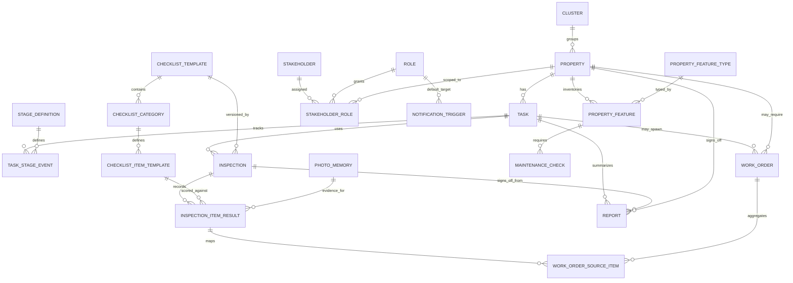
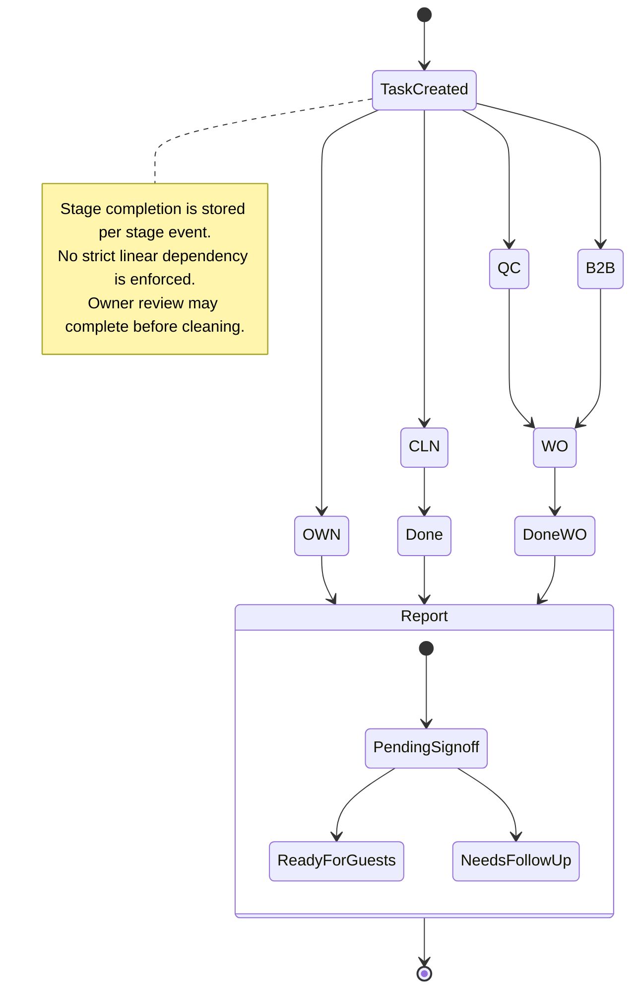

# Agentic STR QC Platform: Phase 1 Architecture

## Entity-Relationship Diagram

## Task Pipeline State Machine (Non-Linear / Parallel)

## Phase 2 Design (Deferred)

- Add a bidi agent layer (Strands + Gemini Live) after Phase 1 state consistency is proven.
- Add telephony, Slack, and email escalation adapters as notification channels.
- Add camera-driven checklist scoring tied to `inspection_item_result` evidence records.
- Add route optimization from `cluster` + property geocoding.

## Data model notes from review fixes

- Stage keys are now data-driven via `stage_definition` (instead of hard-coded CHECK values).
- Property amenity/facility modeling is multi-instance via `property_feature` + `maintenance_check` (supports many TVs/bathrooms/patios and recurring checks like batteries/devices).
- Sensitive credentials use ciphertext/secret-reference fields; migration flags plaintext CSV secrets instead of persisting raw secret values.
- Reports can reference a specific inspection (`report.inspection_id`) and work orders can aggregate multiple failed items (`work_order_source_item`).
